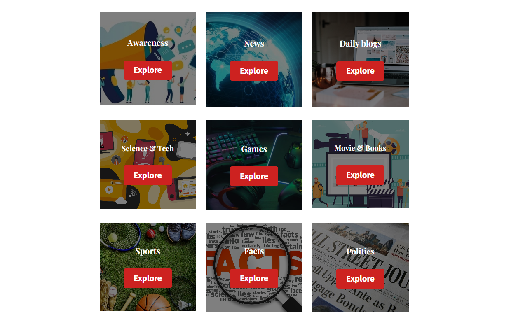
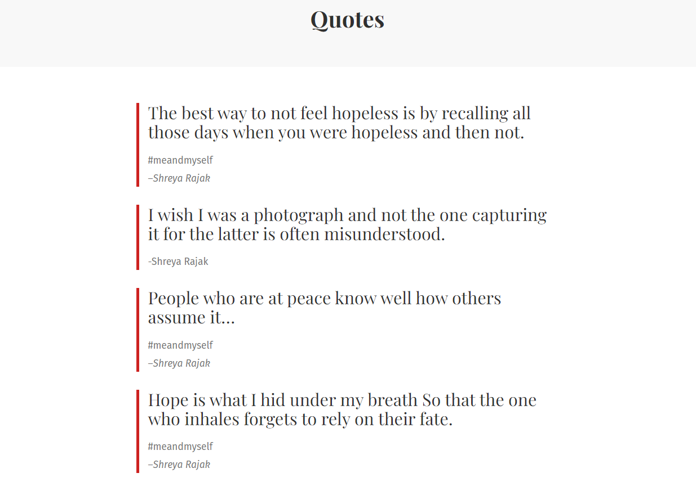
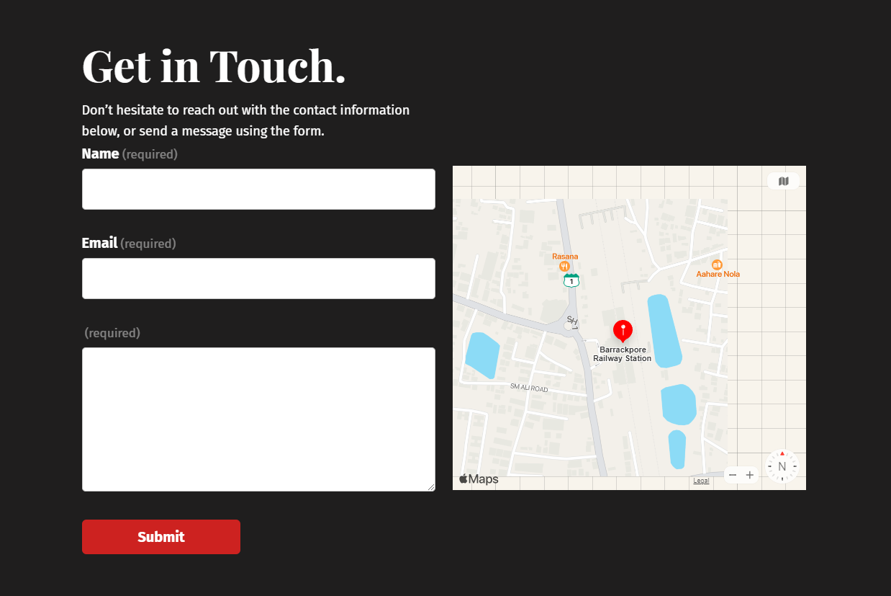

<h1 align="center">DUCKDESK</h1>

**Home Page:**
- The home page serves as the landing page for your website, providing an attractive and engaging introduction.
- It features the latest blog posts, allowing visitors to see the most recent content.
- There are also featured blogs to highlight specific articles that you want to promote.
- The footer section typically contains important links, copyright information, and maybe some contact details or social media links.

**Blogs Page:**
- This page is the main hub for all your blog posts, making it easy for visitors to browse and read articles.
- Blogs are written by school students, providing them with a platform to express their views, learn about technology, and improve their writing skills.

**Category Page:**
- Categories help organize your blog posts into specific topics.
- You've listed various categories such as awareness, daily blogs, news, science, games, movies, sports, facts, politics, festivals, natural & wildlife, and finance.
- Visitors can click on a category to access related articles.

**Quotes Page:**
- This section features inspiring and heart-touching quotes, providing additional content and inspiration for your audience.

**Contact Page:**
- The contact page includes a real-time mailing system that immediately sends sender details to you.
- This allows visitors to get in touch with you or provide feedback.

**About Us Page:**
- The "About Us" section contains information about you and your social links.
- It's a way for visitors to learn more about the person or team behind the blog.

Overall, DUCKDESK appears to be an excellent platform for school students to express themselves, learn valuable skills, and share their thoughts on various topics. It's well-organized with categories, and the contact and about us sections add a personal touch to the site. Keep updating it with fresh content to engage your audience and encourage students to continue their blogging journey.

